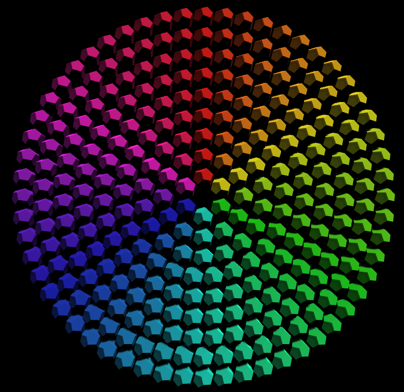

# DT228/DT211/DT282/DT508 Games Engines 1 2020-2021

[](http://www.youtube.com/watch?NMDupdv85FE)

## Resources
- [Class Facebook page](https://www.facebook.com/groups/407619519952058/)
- [Course Notes (out of date!)](https://drive.google.com/open?id=1CeMUWjCUa1Ere2fMmtLz5TCL4O136mxj)
- [Assignment](assignment.md)
- [Unity Tutorials](https://unity3d.com/learn/tutorials) 
- [GDC Vault](http://www.gdcvault.com/)
- [Game maths tutorials](http://www.wildbunny.co.uk/blog/vector-maths-a-primer-for-games-programmers/)

## Contact me
* Email: bryan.duggan@dit.ie
* Twitter: [@skooter500](http://twitter.com/skooter500)
* [My website & other ways to contact me](http://bryanduggan.org)


## Previous years courses
- 2019-2020
    - https://github.com/skooter500/GE1-2019-2020
    - https://github.com/skooter500/GE2-2019-2020
- 2018-2019
    - https://github.com/skooter500/GE1-2018-2019
    - https://github.com/skooter500/GE2-2018-2019
- 2017-2018
    - http://github.com/skooter500/GE2-2017-2018
- 2016-2017
	- http://github.com/skooter500/GAI-2017
	- https://github.com/skooter500/GE2-Supplemental-2017
	- https://github.com/skooter500/GE2-LabTest2-2017
	- https://github.com/skooter500/OrbitalRingsSolution
- 2015-2016
    - https://github.com/skooter500/gameengines2015
    - https://github.com/skooter500/BGE4Unity
- 2014-2015
    - https://github.com/skooter500/BGE
    - https://github.com/skooter500/UnitySteeringBehaviours 
- 2013-2014
    - https://github.com/skooter500/XNA-3D-Steering-Behaviours-for-Space-Ships
	
## Assessment Schedule	
- Week 5 - CA proposal & Git repo - 10%
- Week 13 - CA Submission & Demo - 40%

## Week 2 - Trigonometry & Co-routines, materials & shaders

- [Slides](https://drive.google.com/file/d/1uiPqd1KUUAJwgv56NGR6e5amJMt9uEO2/view?usp=sharing)

## Week 1 - Introduction
## Lecture
- [Slides](https://drive.google.com/file/d/14pWZNf2Z-FX096wCLHt9t6tLorS323-k/view?usp=sharing)
- [Trigonometry Problem Set](https://1.cdn.edl.io/IDqRlI8C9dRkoqehbbdHBrcGT6m87gkCQuMKTkp0U7JvHvuG.pdf)

## Lab
- Become familiar with Unity 
- Use trigonometry and the unit circle to make a generative thing
- Modify a shader

## Instructions

This is a screenshot of the first part of what you guys can make today:



And this is a video of part two, which involves modifying a shader to generate the colours:

[](http://www.youtube.com/watch?tL6ux8isdgY)

- First make sure your fork is updated so you get the latest branches from the upstream.
- Switch to the lab1starter branch:

```bash
git checkout lab1starter
```

### Part A

- Open the scene trigscene and check out the hierarchy and the position and orientation of the camera & the generator.
- Add a new script to the Generator gameobject called Generator
- Add public fields for rings - the number of rings to create and for the prefab to use. 
- Drag the prefab from the project onto the field in the Unity editor
- Now here is the challenge! Write code in the Start method to instantiate instances of the prefab in rings, centred at 0,0,0 on the X-Y plane This will be a nested for loop. But I suggest you try and create one ring first (in a loop) and then enclose that loop in an outer loop to create multiple rings.
- You will see that the inside ring had 5 objects and the subsequent rings increase the number of objects so that the spacing on each ring is equal. You can use the circumference of a circle equation to calculate the number of objects each circle should contain.
- Add a script to the prefab so that it rotates around the Y axis. You should add a field for the rotation speed.
- See if you can figure out how set colours on each loop so that the colours span the hue colour space from 0-1

### Part B

- Create a material called ColorMaterial and assign the shader Custom/ColorShader to the material.
- Assign the material to the prefab by dropping it on the prefab.
- Open up the file ColorShader.shader and look for the function ```void surf (Input IN, inout SurfaceOutputStandard o)```
- You should assign the variable hue to a value between 0 and 1 based on the distance of the vertex from the origin. 
- You have some input variables to work with which are:
```IN.worldPos.x``` and ```IN.worldPos.y``` (the vertex x and y) and some functions you can use sqrt, pow, abs. And the modulus operator %
- You can also use the built in variable _Time that gives the time in seconds since the program started. It's a float.
- If all goes well, you should be able to create the effect in the video.

### Learning Outcomes
- Install Unity & git for Windows
- Sign up for the class Facebook page
- Find the Unity tutorials

### Instructions
- Sign up for the [class Facebook page](https://www.facebook.com/groups/2460751797558448)
- Install Unity
- Fork the repository for the course and clone it
- Check out the [Unity tutorial videos](https://unity3d.com/learn/tutorials)
